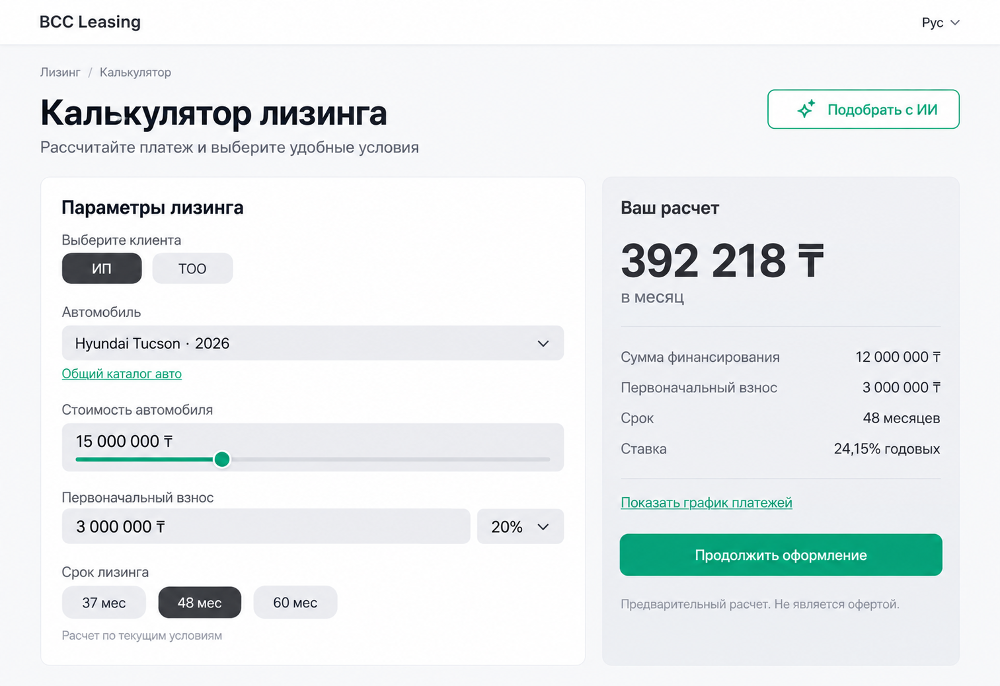
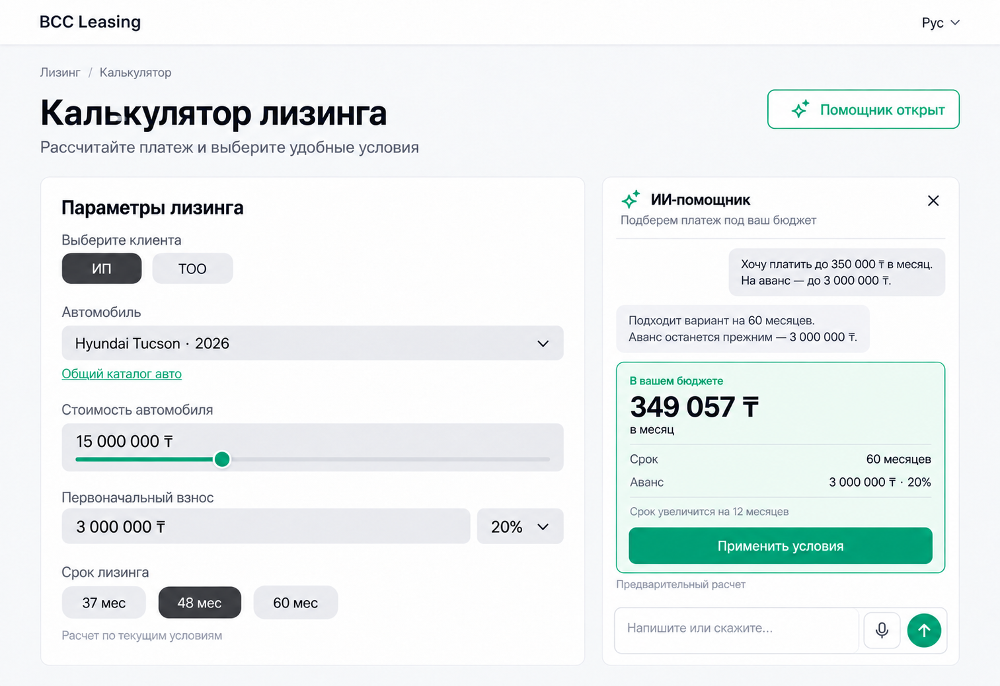
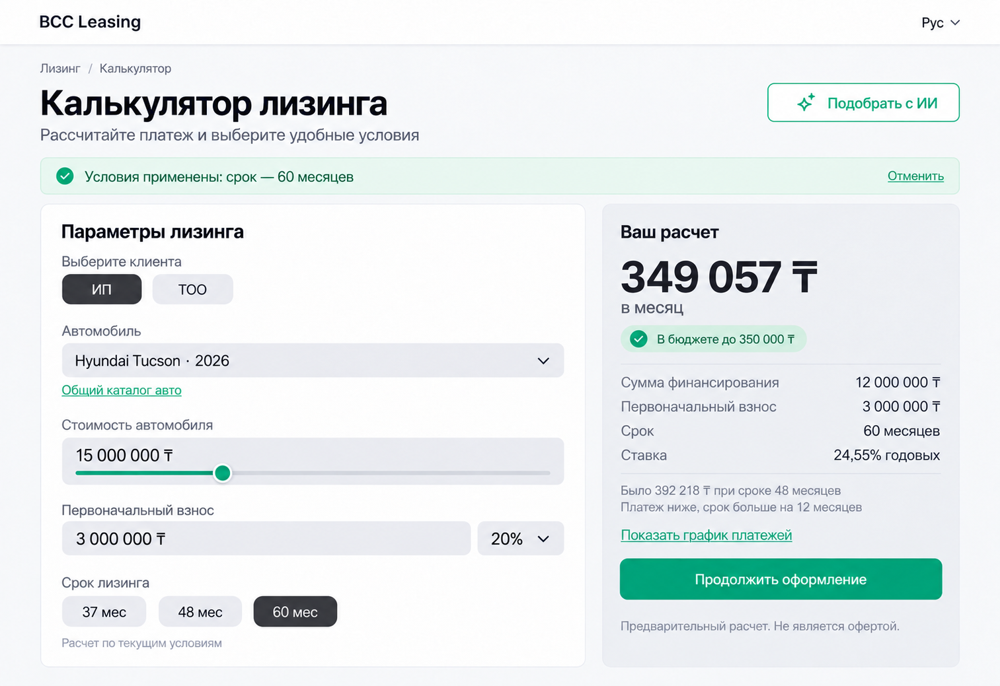

# Согласованные макеты

Изображения подготовлены до разработки как визуальные ориентиры. Работающее приложение находится в `src/`; изображения не используются вместо интерфейса.

## Калькулятор

## Помощник

## Примененные условия

[Исходные промпты генерации](prompts.md).
